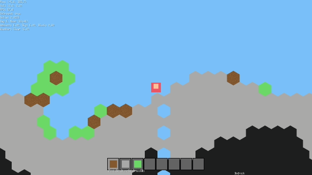

[](https://git.io/typing-svg)

# ⬢ TesselBox-game



 
> **A procedural hexagon-based sandbox adventure.** TesselBox-game is an open-source engine built in Go that explores unique hexagonal world-building, mining, and procedural generation.


---

[](https://ebitengine.org)
[](https://creativecommons.org/licenses/by-nc-sa/4.0/)


[](https://github.com/tesselstudio/TesselBox-game/actions/workflows/go.yml)

### 🚀 Quick Start
Get the game running locally in 30 seconds:

```bash
# Clone the repo
git clone [https://github.com/tesselstudio/TesselBox-game.git](https://github.com/tesselstudio/TesselBox-game.git)
cd TesselBox-game

# Run the game
go run cmd/main.go
```


### Star History

[](https://star-history.com/#tesselstudio/TesselBox-game&Date)

## 🎯 **Language Selector Buttons**

| 🌍 **European** | 🌏 **Asian** | 🌍 **African** |  **Other** |
|----------------|--------------|----------------|----------------|
| [🇬🇧 English](readme/english.md) | [🇨🇳 中文](readme/chinese.md) | [🇹🇿 Swahili](readme/swahili.md) | [🇬🇷 Ελληνικά](readme/greek.md) |
| [🇩🇪 Deutsch](readme/german.md) | [🇯🇵 日本語](readme/japanese.md) | [🇿🇦 Afrikaans](readme/afrikaans.md) |  |
| [🇫🇷 Français](readme/french.md) | [🇰🇷 한국어](readme/korean.md) | [🇪🇹 አማርኛ](readme/amharic.md) |  |
| [🇪🇸 Español](readme/spanish.md) | [🇮🇳 हिन्दी](readme/hindi.md) | [🇳🇬 Yorùbá](readme/yoruba.md) |  |
| [🇮🇹 Italiano](readme/italian.md) | [🇸🇦 العربية](readme/arabic.md) | [🇳🇬 Hausa](readme/hausa.md) |  |
| [🇵🇹 Português](readme/portuguese.md) | [🇧🇩 বাংলা](readme/bengali.md) | [🇳🇬 Igbo](readme/igbo.md) |  |
| [🇷🇺 Русский](readme/russian.md) | [🇹🇷 Türkçe](readme/turkish.md) | [🇿🇦 Zulu](readme/zulu.md) |  |
| [🇵🇱 Polski](readme/polish.md) | [🇭🇰 繁體中文（香港）](readme/traditional_chinese_hk.md) |  |  |
| [🇳🇱 Nederlands](readme/dutch.md) | [🇹🇼 繁體中文（台灣）](readme/traditional_chinese_tw.md) |  |  |
| [🇸🇪 Svenska](readme/swedish.md) |  |  |  |
| [🇩🇰 Dansk](readme/danish.md) |  |  |  |
| [🇳🇴 Norsk](readme/norwegian.md) |  |  |  |
| [🇫🇮 Suomi](readme/finnish.md) |  |  |  |
| [🇨🇿 Čeština](readme/czech.md) |  |  |  |
| [🇭🇺 Magyar](readme/hungarian.md) |  |  |  |

---


## License

**CC BY-NC-SA 4.0 License** - See [LICENSE](LICENSE) file for details.

## Credits
- Original Game: Inspired by Terraria
- Engine: Built with Ebiten (Go)
- Translations: Community volunteers
- Icons: Open source assets


*More languages being added regularly - contributions welcome!*
