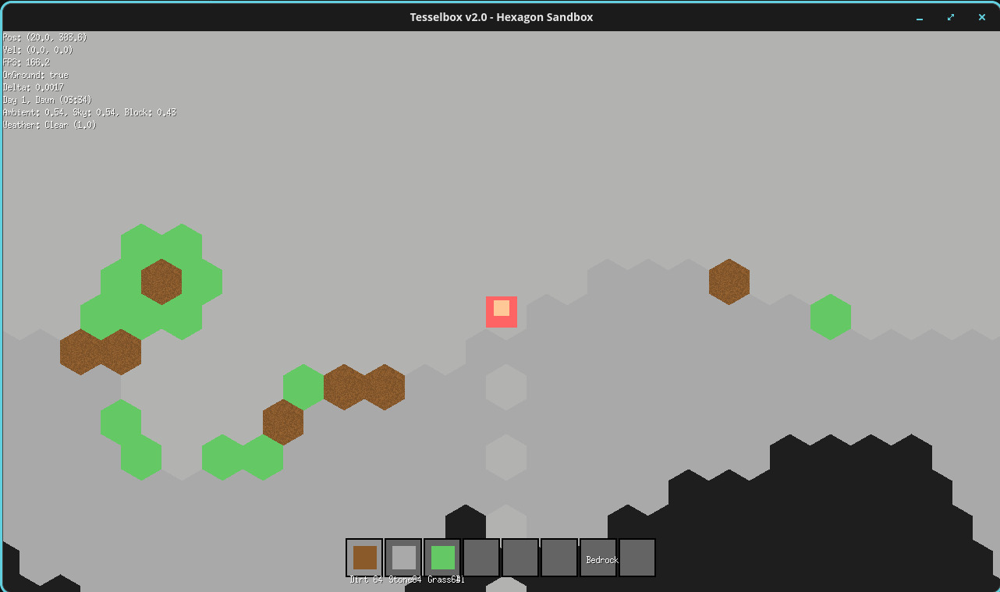

# TesselBox - Multi-Language README 

## 🌍 **Language Selection - Click Any Language Below**

## 🔗 **Direct Language Links**

### **Navigate by Clicking:**
- **[🇺🇸 English](readme/english.md)** - Complete documentation
- **[🇨🇳 中文](readme/chinese.md)** - 完整文档
- **[🇭🇰 繁體中文（香港）](readme/traditional_chinese_hk.md)** - 繁體中文（香港）
- **[🇹🇼 繁體中文（台灣）](readme/traditional_chinese_tw.md)** - 繁體中文（台灣）
- **[🇪🇸 Español](readme/spanish.md)** - Documentación completa
- **[🇫🇷 Français](readme/french.md)** - Documentation complète
- **[🇩🇪 Deutsch](readme/german.md)** - Vollständige Dokumentation
- **[🇯🇵 日本語](readme/japanese.md)** - 完全なドキュメント
- **[🇷🇺 Русский](readme/russian.md)** - Полная документация
- **[🇧🇷 Português](readme/portuguese.md)** - Documentação completa
- **[🇸🇦 العربية](readme/arabic.md)** - الوثائق الكاملة
- **[🇮🇳 हिन्दी](readme/hindi.md)** - पूर्ण दस्तावेज़
- **[🇮🇹 Italiano](readme/italian.md)** - Documentazione completa
- **[🇳🇱 Nederlands](readme/dutch.md)** - Volledige documentatie
- **[🇰🇷 한국어](readme/korean.md)** - 완전한 문서
- **[🇹🇷 Türkçe](readme/turkish.md)** - Tam dokümantasyon
- **[🇵🇱 Polski](readme/polish.md)** - Pełna dokumentacja
- **[🇸🇪 Svenska](readme/swedish.md)** - Fullständig dokumentation
- **[🇨🇿 Čeština](readme/czech.md)** - Úplná dokumentace
- **[🇬🇷 Ελληνικά](readme/greek.md)** - Πλήρης τεκμηρίωση
- **[🇧🇩 বাংলা](readme/bengali.md)** - সম্পূর্ণ ডকুমেন্টেশন
- **[🇹🇿 Kiswahili](readme/swahili.md)** - Hati kamili
- **[🇿🇦 Afrikaans](readme/afrikaans.md)** - Volledige dokumentasie
- **[🇪🇹 አማርኛ](readme/amharic.md)** - ሙሉ ሰነዶች
- **[🇳🇬 Yorùbá](readme/yoruba.md)** - Àwọn àkọsílẹ̀ tí ó pẹ̀
- **[🇳🇬 Hausa](readme/hausa.md)** - Cikakken takardu
- **[🇳🇬 Igbo](readme/igbo.md)** - Akwụkwọ zuru oke
- **[🇿🇦 Zulu](readme/zulu.md)** - Imibhalo egcwele
- **[🇩🇰 Dansk](readme/danish.md)** - Fuldstændig dokumentation
- **[🇭🇺 Magyar](readme/hungarian.md)** - Teljes dokumentáció
- **[🇫🇮 Suomi](readme/finnish.md)** - Täydellinen dokumentaatio
- **[🇳🇴 Norsk](readme/norwegian.md)** - Fullstendig dokumentasjon

---

## ⚡ **One-Click Navigation**

### **Choose Your Language:**
- **繁體中文（香港）**: [📖 閱讀](readme/traditional_chinese_hk.md)
- **繁體中文（台灣）**: [📖 閱讀](readme/traditional_chinese_tw.md)
- **English**: [📖 Read Now](readme/english.md)
- **中文**: [📖 阅读](readme/chinese.md)
- **Español**: [📖 Leer](readme/spanish.md)
- **Français**: [📖 Lire](readme/french.md)
- **Deutsch**: [📖 Lesen](readme/german.md)
- **日本語**: [📖 読む](readme/japanese.md)
- **Русский**: [📖 Читать](readme/russian.md)
- **العربية**: [📖 اقرأ](readme/arabic.md)
- **हिन्दी**: [📖 पढ़ें](readme/hindi.md)
- **Português**: [📖 Ler](readme/portuguese.md)

---

## 🎯 **Language Selector Buttons**

| 🌍 **European** | 🌏 **Asian** | 🌍 **African** |  **Other** |
|----------------|--------------|----------------|----------------|
| [🇬🇧 English](readme/english.md) | [🇨🇳 中文](readme/chinese.md) | [🇹🇿 Swahili](readme/swahili.md) | [🇬🇷 Ελληνικά](readme/greek.md) |
| [🇩🇪 Deutsch](readme/german.md) | [🇯🇵 日本語](readme/japanese.md) | [🇿🇦 Afrikaans](readme/afrikaans.md) |  |
| [🇫🇷 Français](readme/french.md) | [🇰🇷 한국어](readme/korean.md) | [🇪🇹 አማርኛ](readme/amharic.md) |  |
| [🇪🇸 Español](readme/spanish.md) | [🇮🇳 हिन्दी](readme/hindi.md) | [🇳🇬 Yorùbá](readme/yoruba.md) |  |
| [🇮🇹 Italiano](readme/italian.md) | [🇸🇦 العربية](readme/arabic.md) | [🇳🇬 Hausa](readme/hausa.md) |  |
| [🇵🇹 Português](readme/portuguese.md) | [🇧🇩 বাংলা](readme/bengali.md) | [🇳🇬 Igbo](readme/igbo.md) |  |
| [🇷🇺 Русский](readme/russian.md) | [🇹🇷 Türkçe](readme/turkish.md) | [🇿🇦 Zulu](readme/zulu.md) |  |
| [🇵🇱 Polski](readme/polish.md) | [🇭🇰 繁體中文（香港）](readme/traditional_chinese_hk.md) |  |  |
| [🇳🇱 Nederlands](readme/dutch.md) | [🇹🇼 繁體中文（台灣）](readme/traditional_chinese_tw.md) |  |  |
| [🇸🇪 Svenska](readme/swedish.md) |  |  |  |
| [🇩🇰 Dansk](readme/danish.md) |  |  |  |
| [🇳🇴 Norsk](readme/norwegian.md) |  |  |  |
| [🇫🇮 Suomi](readme/finnish.md) |  |  |  |
| [🇨🇿 Čeština](readme/czech.md) |  |  |  |
| [🇭🇺 Magyar](readme/hungarian.md) |  |  |  |

---

## 📚 **Complete Language Index**

### **A-Z Language Links:**
- **[Afrikaans](readme/afrikaans.md)** 🇿🇦
- **[አማርኛ](readme/amharic.md)** 🇪🇹
- **[العربية](readme/arabic.md)** 🇸🇦
- **[বাংলা](readme/bengali.md)** 🇧🇩
- **[Čeština](readme/czech.md)** 🇨🇿
- **[Dansk](readme/danish.md)** 🇩🇰
- **[Deutsch](readme/german.md)** 🇩🇪
- **[English](readme/english.md)** 🇬🇧
- **[Ελληνικά](readme/greek.md)** 🇬🇷
- **[Español](readme/spanish.md)** 🇪🇸
- **[Suomi](readme/finnish.md)** 🇫🇮
- **[Français](readme/french.md)** 🇫🇷
- **[Hausa](readme/hausa.md)** 🇳🇬
- **[हिन्दी](readme/hindi.md)** 🇮🇳
- **[Magyar](readme/hungarian.md)** 🇭🇺
- **[Igbo](readme/igbo.md)** 🇳🇬
- **[Italiano](readme/italian.md)** 🇮🇹
- **[日本語](readme/japanese.md)** 🇯🇵
- **[한국어](readme/korean.md)** 🇰🇷
- **[Kiswahili](readme/swahili.md)** 🇹🇿
- **[Nederlands](readme/dutch.md)** 🇳🇱
- **[Norsk](readme/norwegian.md)** 🇳🇴
- **[Polski](readme/polish.md)** 🇵🇱
- **[Português](readme/portuguese.md)** 🇧🇷
- **[Русский](readme/russian.md)** 🇷🇺
- **[Svenska](readme/swedish.md)** 🇸🇪
- **[Türkçe](readme/turkish.md)** 🇹🇷
- **[Yorùbá](readme/yoruba.md)** 🇳🇬
- **[Zulu](readme/zulu.md)** 🇿🇦
- **[中文](readme/chinese.md)** 🇨🇳
- **[繁體中文（香港）](readme/traditional_chinese_hk.md)** 🇭🇰
- **[繁體中文（台灣）](readme/traditional_chinese_tw.md)** 🇹🇼

## License

**CC BY-NC-SA 4.0 License** - See [LICENSE](LICENSE) file for details.

## Credits
- Original Game: Inspired by Terraria
- Engine: Built with Ebiten (Go)
- Translations: Community volunteers
- Icons: Open source assets

*More languages being added regularly - contributions welcome!*
